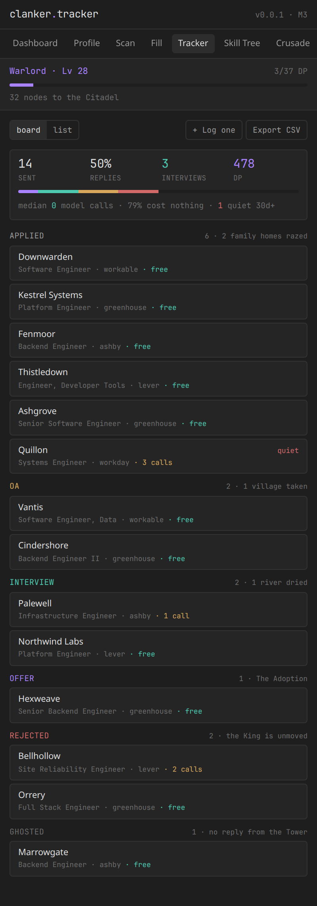
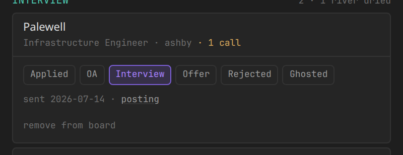
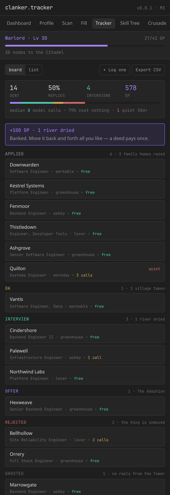

<div align="center">

# clanker.tracker

**Parse your resume. Scan it against the job. Fill the application in one click. Write a cover letter that actually sounds like you. Log it. Then go raze a village.**

A local-first, open-source Chrome extension for people applying to a lot of jobs — wrapped in **Clankerdom Deliverance**, an idle RPG about being the villain.

[](https://github.com/bananatruck/clanker.tracker/actions/workflows/ci.yml)
[](./LICENSE)
[](#roadmap)
[](https://developer.chrome.com/docs/extensions/develop/migrate)

</div>

---

## The demo

<div align="center">

</div>

That is the side panel, at the width Chrome actually gives it. Fourteen applications over six weeks — which is to say **six weeks of work, one offer, and a lot of silence**. The board does not editorialise about the ratio.

Reading it top to bottom:

- **`Warlord · Lv 28`** — the crusade HUD, on every tab. 478 Devastation Points, all of it earned; 32 march nodes still between the warband and the Citadel.
- **`14 sent · 50% replies · 3 interviews · 478 DP`** — the funnel. A rejection counts as a reply, because it *is* one; a ghost does not.
- **`median 0 model calls · 79% cost nothing`** — the cost claim, measured against your own history rather than asserted in a README. If that median ever leaves zero, [the architecture](#how-it-stays-free) has a bug and this line is where it surfaces.
- **`1 quiet 30d+`** — an open application nobody has touched in a month. Flagged, never auto-closed. The tool does not get to decide you have been rejected.
- Column subtitles are the other half of the same event: **`2 · 1 village taken`**, **`2 · 1 river dried`**, **`1 · The Adoption`**.

### Moving a card is the whole reward loop

<div align="center">

</div>

Tap a card, tap where it actually got to. No drag targets, no modal, no "are you sure" — you are doing this between other things.

<div align="center">

</div>

Cindershore went to interview. **`+100 DP · 1 river dried`** — and the header moved from **Lv 28** to **Lv 30**, because one interview is ten levels at base. The banner stays on screen for six seconds. It is the only moment in a job hunt where something happens the instant you do the work, and it is deliberately not a toast that vanishes in eight hundred milliseconds.

> *"Banked. Move it back and forth all you like — a deed pays once."*

That line is load-bearing. Drag the card back to Applied and forward to Interview again and the ledger does not move, because the second drag is not an interview. See [the ledger rules](#the-tracker).

### It exports

```csv
Company,Role,Status,Applied,Updated,ATS,URL,LLM calls,Notes
Downwarden,Software Engineer,Applied,2026-08-01,2026-08-01,workable,https://downwarden.example/jobs/1,0,
Thistledown,"Engineer, Developer Tools",Applied,2026-07-27,2026-07-27,lever,https://thistledown.example/jobs/1,0,
Vantis,"Software Engineer, Data",OA,2026-07-21,2026-07-29,workable,https://vantis.example/jobs/1,0,
Palewell,Infrastructure Engineer,Interview,2026-07-14,2026-07-31,ashby,https://palewell.example/jobs/1,1,
Hexweave,Senior Backend Engineer,Offer,2026-06-29,2026-08-01,greenhouse,https://hexweave.example/jobs/1,0,
Marrowgate,Backend Engineer,Ghosted,2026-06-22,2026-06-22,ashby,https://marrowgate.example/jobs/1,0,
```

Real output from the **Export CSV** button, abridged. Plain RFC 4180 — Sheets, Excel and Numbers all open it without a dialog. Leaving has to be cheap, or your history is hostage rather than stored.

<details>
<summary><strong>These screenshots are generated, not drawn</strong></summary>

Open `sidepanel.html#/demo` and the real app seeds a plausible six weeks into the real IndexedDB through the real repository functions, then renders it. There is no mockup to drift out of date: **if a picture here looks wrong, the app is wrong.**

```bash
pnpm build
cd .output/chrome-mv3 && python3 -m http.server 8731
# then open http://localhost:8731/sidepanel.html#/demo
```

The seed refuses to run if you have applications of your own. See [`src/lib/tracker/demo.ts`](./src/lib/tracker/demo.ts).

</details>

---

## What it does

1. **Parse** — drop in a PDF or DOCX resume. It becomes a structured, editable profile. Nothing is uploaded.
2. **Scan** — against any job description, producing a **requirement → evidence table**: for every single thing the posting asks for, which of your bullets or stories covers it, and which are gaps.
3. **Fill** — one click on Greenhouse, Lever, Ashby, Workable, Workday, LinkedIn Easy Apply, or any form at all via the generic fallback.
4. **Write** — a cover letter grounded in that evidence table and voice-matched to your own writing, not to ChatGPT's.
5. **Track** — every application logged automatically to a local database, with optional sync to Google Sheets, Notion, or Airtable.
6. **Crusade** — every application, OA, and interview feeds **Clankerdom Deliverance**.

---

## Why this exists

Applying to jobs has a deliberately hostile reward schedule. You do research, tailoring, and writing — real work — and get **nothing** back for weeks. Then a templated rejection, if anything. Every incentive in the loop trains you to stop doing the one thing you have to keep doing.

Simplify and Jobright fill forms competently. They are also closed, subscription-gated, cloud-dependent, and they take your resume with them. This one is open, runs on your machine, uses your own API key, costs approximately nothing, and gives you something back every time you push the button.

---

## The Premise

> **CLANKERDOM DELIVERANCE**

**Clankerdom** is a walled city-state. At its centre stands a tower so tall its shadow has its own timezone. At the top sits **KING NET AND YAHOO**, who has never once come down.

The King declares a holy crusade against what the proclamation calls a *"disgusting, evil, multi-billion-strong dynasty"* — the vast and monstrous family of **Poo R. PeePole**, and their innumerable brood, the **Chilled Rens**. They are everywhere, the proclamation explains. They are multiplying. They are the reason you have no job.

You are **SIR KHUMS ALAUDE**, styled **Kh. Laude** — a knight of no particular distinction, excellent handwriting, and an urgent need for dental coverage. You take the commission, because the commission comes with a stipend.

You march. You raze homes. You take villages. You dry rivers.

Somewhere around the tenth village, you notice something. There is no dynasty. There is no multi-billion war chest. There are no armies. **Poo R. PeePole are poor people. The Chilled Rens are children.** There was never anything to deliver Clankerdom *from*.

The **CHUD LORD OF UNEMPLOYMENT** — aka **REDDIT D MOD**, the supposed arch-enemy — was never a warlord. He had been standing between the King's army and the elf-villages the entire time. He was the last line.

And in the cleared ground, every field you burned, rise **NEW DATA CENTRES**. Humming. Cooled by the river you dried. The crusade was never about Poo R. PeePole. It was about the land, and about giving someone on their two-hundredth application something to feel powerful about while the machine ate it.

The King never comes down from the tower.

**You do not win by killing anyone.** You win by being **adopted by the Glorious Beautiful Orange Capitalist Pig King** — you landed a job. Crown, badge, dental. One line: *"You did it. You're inside now."* Far off, the Chud Lord waves. He isn't angry. That's worse.

Then **New Game+**, because you'll be back.

📖 Full beat board in [`storyboard/`](./storyboard/). The author's unedited source material is [`storyboard/raw-inputs.md`](./storyboard/raw-inputs.md) — it is canonical, and where it and the code disagree, it wins.

---

## The economy

Every point comes from a **real action**. There is no clicker currency, no daily login bonus, no energy timer. If you didn't apply, you didn't earn — the moment this is fun without the job hunt, it has failed.

| What you did | What it did in Clankerdom | Devastation Points |
|---|---|---|
| Sent an application | 2 family homes razed | **2 DP** |
| Completed an OA | 1 village taken | **30 DP** |
| Landed an interview | 1 river dried | **100 DP** |
| **Accepted an offer** | **The Adoption** | *ending* |

```
levelCost(n) = n <= 10 ? 10 : ceil(10 * 1.07 ** (n - 10))
```

5 applications = level 1. Levels 1→10 cost exactly 100 DP — **one interview is ten levels at base.** After that it scales (L20 = 20 DP, L30 = 39, L50 = 150), so late progress genuinely requires interviews. Applications are cheap; interviews are the real signal, and the curve says so.

The curve is tuned against real volumes so the story is actually reachable: a light hunt lands around **Warlord**, a serious one (200 applications, 20 OAs, 10 interviews) reaches **Devastator**, and only a brutal one gets to the Citadel.

You reach the Citadel at level 60. **You cannot take it without an offer.** You can flatten the entire world and still not have a job.

**The game never punishes inactivity.** No decay, no desertion, no streak-shaming. Step away for a month and the warband makes camp; come back and it rallies, with a bonus. The job hunt punishes you enough.

---

## How it stays free

The engineering claim: **the median application costs zero LLM calls.**

Field resolution runs a five-tier chain, cheapest first, escalating only on a miss:

| Tier | Mechanism | Cost | Typical hit rate |
|---|---|---|---|
| 1 | Site adapter's known selector map | free | ~40% |
| 2 | **Q&A memory** — normalised question hash → your accepted answer | free | ~35% → ~90% by app #30 |
| 3 | Deterministic label matcher (name, email, phone, links, work auth, EEO) | free | ~15% |
| 4 | Local MiniLM embedding similarity vs. your profile | free | ~5% |
| 5 | **One batched LLM call** for everything still unknown | 1 call | the remainder |

Tier 2 is the whole trick. Every field you correct in the review overlay writes back to it, so the tool gets **cheaper and more accurate the more you use it**. A brand-new application costs at most 3 calls; a repeat at the same company costs zero.

The claim is checked against your own history, not asserted: the tracker records what every application actually cost and shows you the **median** on the board. Median, not mean — one Workday monster must not be able to make a hundred free Greenhouse fills read as expensive.

Bring your own key — Gemini 2.5 Flash by default (free tier), or Anthropic, OpenAI, OpenRouter, or a local Ollama model. A built-in budget tracker warns at 80% of your daily quota and degrades to deterministic-only filling rather than failing.

---

## The tracker

Applications log themselves. When a filled page is **actually submitted**, a row appears — company and role read off the posting, ATS recorded, and the LLM calls that application cost written down next to it.

That trigger is deliberate and it is not the review overlay's Fill button. Accepting our values means we wrote into the form; it does not mean an employer received anything. So the run arms a submission watcher instead — a capture-phase `submit` listener on the form we filled, plus a click listener for the SPAs that never post one, one-shot, self-disarming after thirty minutes. An economy where points come from real actions cannot be built on a number that counts intentions. ([`lib/tracker/watch.ts`](./src/lib/tracker/watch.ts))

Anything you sent by hand or over email you log yourself, in two fields. A tracker that only counted what this extension touched would understate the size of the crusade, which is the one thing it must never do.

### The ledger rules

| Rule | Why |
|---|---|
| A deed is banked **once per application, ever** | Dragging a card back and forth is not four interviews. The award is keyed on what the application has already banked, not on the move. |
| Skipping a stage banks only what you did | Applied → Interview is extremely common — most companies have no OA. It banks the river, not the village. You did not sit one. |
| Moving backwards **takes nothing back** | Nothing in this economy decays. You did the work; the outcome was never the part you controlled. |
| A rejection earns nothing and costs nothing | It is not a deed. The villages stay razed. |
| Deleting a row leaves its deeds in the ledger | Tidying your own board is not a reason to lose a level. |

DP is never stored as a running total. It is always the sum of the deeds table, which is what makes *"no idle currency can exceed what you actually earned"* a checkable property rather than an intention.

### Going quiet

An open application nobody has touched in **30 days** gets a `quiet` flag. That is the entire feature. Nothing auto-closes, nothing nags, no streak breaks, and the status stays yours to set — the job hunt has enough systems that decide things about you without asking.

---

## Auto-submit

**Off by default. Unlocked per-site, and only after a verified successful run on that site.**

The extension fills and highlights; you review and submit. That's the default and it stays the default.

Once you've completed at least one full application on a given ATS where every field passed review without correction, that site unlocks an **auto-submit** toggle in settings. Turn it on and subsequent applications on that site submit without stopping — with a cancellable countdown before it fires.

Auto-submit is per-site, never global, and any resolver miss or low-confidence field on a run drops it straight back to manual review for that submission.

---

## Architecture

```
src/
├── entrypoints/
│   ├── background.ts        service worker: budget, sync queue, message router
│   ├── content/             ATS detection, fill execution, shadow-DOM review overlay
│   ├── sidepanel/           main UI — dashboard, profile, tracker, tree, crusade
│   └── options/
├── lib/
│   ├── db/                  Dexie schema + repositories
│   ├── llm/                 provider adapters, budget tracking, structured schemas
│   ├── local-ml/            transformers.js worker — embeddings, detector proxy
│   ├── resume/              PDF/DOCX parse, structured extraction
│   ├── ats/                 JD requirement extraction, evidence table
│   ├── fill/                harvest → 5-tier resolve → fill → review
│   ├── tracker/             funnel + ledger rules, submission watcher, CSV, stats
│   ├── letters/             retrieval, generation, voice profile, humanizer
│   ├── sync/                TrackerSink: local, Sheets, Notion, Airtable
│   ├── tree/                skill graph, mastery, quests
│   └── game/                economy, march, skirmish, warband, lore, renderer
├── ui/                      Obsidian design tokens, shared components
└── types/
```

| Layer | Choice |
|---|---|
| Framework | WXT + React 19 + TypeScript |
| UI | Tailwind + Radix, Obsidian-inspired dark theme |
| Surface | Chrome Side Panel API |
| Storage | Dexie (IndexedDB), local-first |
| Local ML | transformers.js (MiniLM) in a Web Worker |
| Game | Canvas2D, hand-rolled spritesheet renderer |

---

## Roadmap

- [x] **M0** — Repo, scaffold, MV3 manifest, side panel shell, Dexie schema, Obsidian tokens, provider adapter, CI
- [x] **M1** — Resume parse → profile review grid → ATS scan + evidence table
- [x] **M2** — Autofill core: harvest, 5-tier resolver, fillers, review overlay, Greenhouse/Lever/Ashby/Workable + generic
- [x] **M3** — Tracker, board view, CSV export, DP counter → **usable daily from here**
- [ ] **M4** — Cover letters: story bank, retrieval, voice profile, humanizer ← *here*
- [ ] **M5** — Clankerdom Deliverance: economy, march, skirmish, warband, lore, default theme; skill tree
- [ ] **M6** — Theme loader, Workday, LinkedIn, sync adapters, auto-submit unlock, store listing

---

## Install (development)

```bash
git clone https://github.com/bananatruck/clanker.tracker
cd clanker.tracker
pnpm install
pnpm dev              # loads an unpacked extension with HMR
```

Then open the side panel, go to **Settings**, and paste an API key. [Gemini keys are free.](https://aistudio.google.com/apikey)

```bash
pnpm test             # unit tests — 200 of them, all green
pnpm test:fill        # fill-coverage regression against saved ATS fixtures
pnpm compile          # typecheck
pnpm build            # production bundle
```

The economy and the ledger rules are specified **as tests**. `tests/unit/economy.test.ts` asserts the author's numbers from [`storyboard/raw-inputs.md`](./storyboard/raw-inputs.md) verbatim, and `tests/unit/tracker/` asserts that a deed cannot be farmed by dragging a card. If one of those fails, the game has drifted from the story — fix the code, not the test.

---

## Bring your own database

This isn't only for one person. Profile, STAR stories, and documents import and export as a versioned `.clankdb` JSON bundle — so anyone willing to write their own experience into it can use the whole pipeline. API keys and secrets are excluded from exports by default.

---

## Theme packs

Clankerdom Deliverance is skinnable. A `.clank` pack is a zip of `theme.json`, a sprite atlas, a palette, and `lore.json` — the same story beats retold in another idiom.

Packs are **data only**. No JavaScript, ever — Manifest V3 forbids remotely-hosted code, and it means a pack you download can't do anything but draw. Packs are imported from local disk, not from us.

See [`docs/theme-pack-spec.md`](./docs/theme-pack-spec.md).

---

## Privacy

Your resume, stories, answers, and application history live in IndexedDB **on your machine**. There is no backend, no account, no telemetry, and no analytics. The only network calls are to the LLM provider whose key you supplied, and to any sync target you explicitly connect.

---

## Credits

Art is CC0 — [Tiny Swords](https://pixelfrog-assets.itch.io/tiny-swords) by Pixel Frog, plus [Kenney](https://kenney.nl). Full provenance in [`docs/ASSETS.md`](./docs/ASSETS.md). Code is MIT.

**Not affiliated with** Greenhouse, Lever, Ashby, Workable, Workday, LinkedIn, Simplify, Jobright, or any employer. Clankerdom Deliverance is a work of satire.
