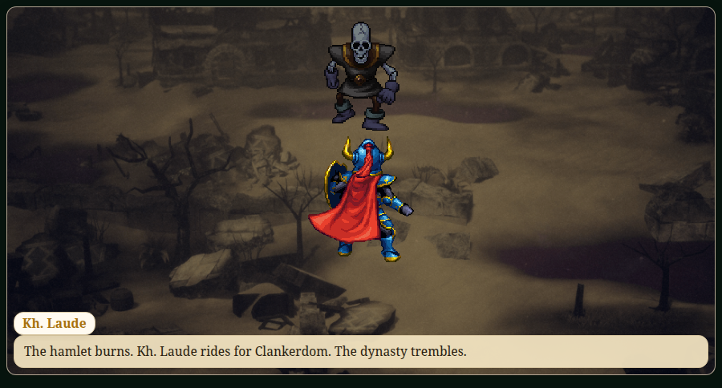
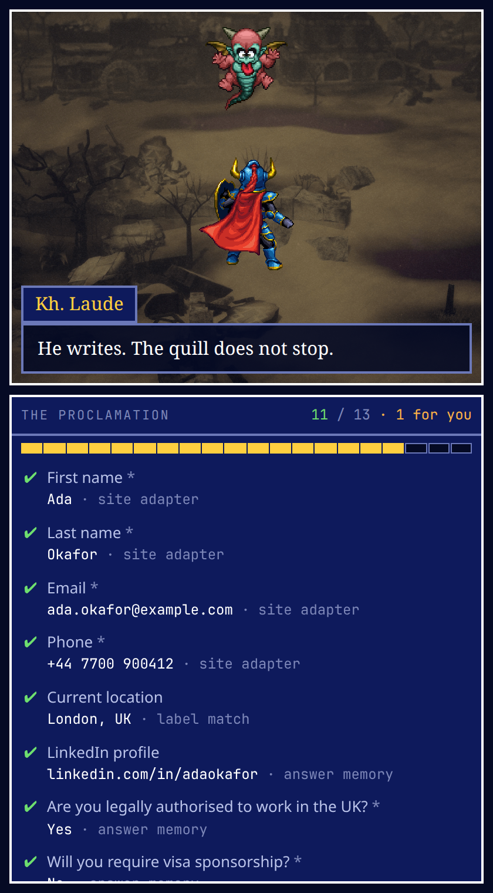
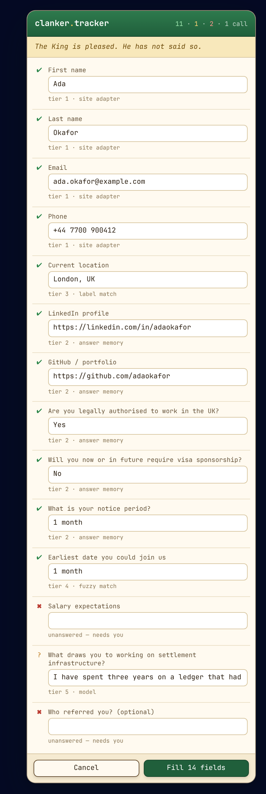
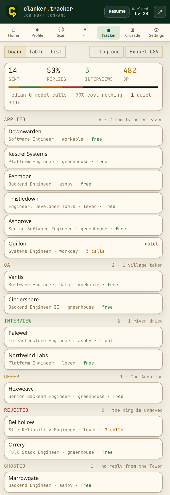
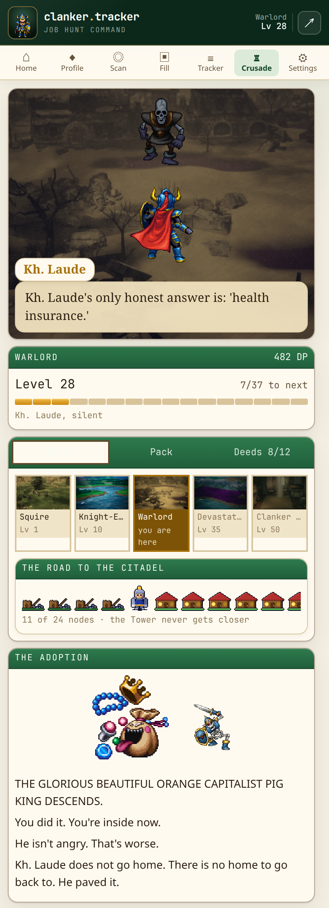
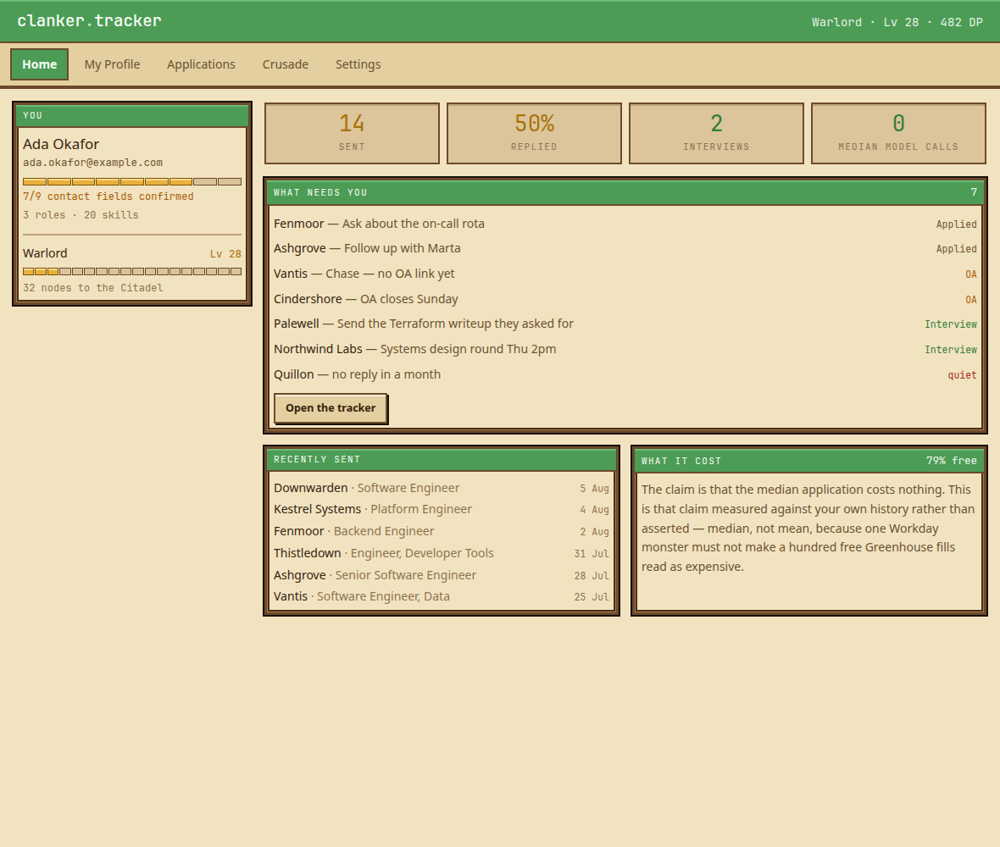

<div align="center">

# clanker.tracker



**Parse your resume. Scan it against the job. Fill the application in one click.**
**Write a cover letter that actually sounds like you. Log it. Then go raze a village.**

A local-first, open-source Chrome extension for people applying to a lot of jobs — wrapped in **Clankerdom Deliverance**, an idle RPG about being the villain.

[](https://github.com/bananatruck/clanker.tracker/actions/workflows/ci.yml)
[](./LICENSE)
[](#-roadmap)
[](#-install)
[](https://developer.chrome.com/docs/extensions/develop/migrate)

</div>

---

## ▶ COMMAND

```
╔══════════════════════════════════════════════════════════════╗
║  CLANKERDOM DELIVERANCE                          Lv 28  ▓▓░  ║
╠══════════════════════════════════════════════════════════════╣
║                                                              ║
║   ▶ PARSE      drop a PDF. it never leaves your machine.     ║
║     SCAN       every requirement → your evidence, or a gap.  ║
║     FILL       any application form. median cost: 0 calls.   ║
║     WRITE      a cover letter grounded in that evidence.     ║
║     TRACK      what you sent, and what it actually cost.     ║
║     CRUSADE    every application razes two family homes.     ║
║                                                              ║
╚══════════════════════════════════════════════════════════════╝
```

Six screens in a Chrome side panel. Everything above the last line is a real job-hunting tool; the last line is what makes you open it again tomorrow.

---

## ▶ WHAT IT LOOKS LIKE

Every image below is the extension itself, rendering the real database. `pnpm shots` serves the
built bundle, seeds a plausible six weeks of applying through the same repo functions a real user
would, and photographs each screen over the DevTools protocol. Nothing here was drawn in a design
tool — **a screenshot that looks wrong means the app is wrong**, which is the only reason to have
screenshots at all.

The interface is parchment in a carved wooden frame, because that is the RPG idiom that survives
being read for an hour: dark ink on cream is 12:1 contrast, and the navy command window it
replaced was 4.4:1.

<table>
<tr>
<td width="25%"></td>
<td width="25%"></td>
<td width="25%"></td>
<td width="25%"></td>
</tr>
<tr>
<td align="center"><b>Filling</b><br><sub>every field, ticked as it lands</sub></td>
<td align="center"><b>Review</b><br><sub>the step before submission</sub></td>
<td align="center"><b>Tracker</b><br><sub>honest about its own funnel</sub></td>
<td align="center"><b>Crusade</b><br><sub>the act you are standing in</sub></td>
</tr>
</table>

While a fill runs, the panel splits: the crusade on top, and under it **every question the
form asks**, ticking over one at a time with the tier that answered each. "Filled 22 fields" is
not a claim anyone can check. A list of the actual questions is — and the short list at the
bottom, of things the tool refused to invent, is the tool working rather than failing.

The **review overlay** is the one that matters. Every row says which tier answered it — *site
adapter*, *answer memory*, *label match*, *fuzzy match*, *model* — so the cost of an application is
visible at the moment you approve it rather than asserted in a README. Eleven certain, one model
call, two left blank because guessing would have been worse than asking.

There is a **full-page dashboard** as well, in its own tab, for the half of a job hunt the panel
is the wrong shape for — reading your own history, correcting what the parser got wrong, seeing
what six weeks of applying actually produced.

<div align="center">

</div>

It carries no upgrade card, no match score, no recruiter-visibility toggle and no streak. Every
one of its five sections is a place your own data lives.

The rest — [Profile](./docs/demo/profile.png), [Scan](./docs/demo/scan.png),
[Fill](./docs/demo/fill.png), [Settings](./docs/demo/settings.png) — are in
[`docs/demo/`](./docs/demo/).

---

## ▶ THE FLOW

An application is not one action. It is a queue of them, and until now the extension knew how to
do the middle step and nothing about the shape around it — so every other step was yours to
remember.

**It offers first.** A side panel you have to remember to open is a side panel nobody opens. The
moment a page turns out to be an application, a badge appears in the corner with Kh. Laude on it
and a count of what is waiting. Press it and the run starts. Dismiss it and it stays dismissed
until the next posting.

**It gets past the wall.** Half of all applications begin with *create an account*, and the
account is a formality that exists so the board can email you a rejection. With sign-in details
saved, that step happens without you.

Reading that wall is where the care goes, because getting it backwards is expensive — a new
password typed into a sign-in form fails the login, and an existing address typed into a signup
form burns it. So [`lib/fill/account.ts`](./src/lib/fill/account.ts) classifies from structure
first and wording second:

| The page has | It is | Because |
|---|---|---|
| Two password boxes | **Signup** | Nothing else asks twice, in any language |
| One password box | **Login**, unless the wording is unambiguously a signup | Signing in without an account fails harmlessly; signing up with an address you already used does not |
| No password box, and it says it emailed you | **Confirmation wall** | Nothing on that page moves until you click their link |
| No password box, and it doesn't | **No wall** | The application is right here |

**Then the order, and the two edges that matter.** A confirmation wall outranks everything —
hammering the form behind it is how an address gets rate-limited. And fields the resolver handed
back **block the send**: refusing to invent a salary expectation is the tool working, and
submitting over that empty box would throw the refusal away and send a worse application than you
would have.

```
account ─▶ fill ─▶ cover letter ─▶ confirm ─▶ sent, logged, banked
   │                    │              ▲
   └─ blocked           └─ only if     └─ nothing is ever sent
      without a yes        it asks        without this
```

The whole order is a pure function in [`lib/fill/stage.ts`](./src/lib/fill/stage.ts) — no DOM, no
storage — so it is asserted in tests rather than clicked through on a job board.

### Where the password lives

`chrome.storage.local`, next to the API key, and **never** IndexedDB. That split is why a
`.clankdb` export can dump every table without leaking a credential.

Said plainly, because a password store that oversells itself is worse than one that doesn't
exist: **it is not encrypted at rest.** It is a file in your Chrome profile, and anything with
your unlocked machine can read it. Automatic sign-up is **off by default** — typing a password
into a page is not a thing to do on someone's behalf until they've said so once — and there is a
*forget these* button, because a store you can't empty is a trap.

---

## ▶ THE PARTY

| Who | Role |
|---|---|
| **Sir Khums Alaude** — "Kh. Laude" | You. Excellent handwriting, no dental coverage. Took the commission because it came with a stipend. |
| **Poo R. PeePole** | The "disgusting, evil, multi-billion-strong dynasty" of the proclamation. In fact: poor people. They do not fight back. |
| **The Chilled Rens** | Their brood. In fact: children. One of their drawings survives the rubble and stays in your inventory. |
| **The Chud Lord of Unemployment** | Cast as the arch-villain. Was the last line of defence between the King's army and the elf-villages. |
| **The Orange Capitalist Pig King** | Glorious. Beautiful. Orange. Fat. Adopts you when you land a job. The win condition. |
| **King Net And Yahoo** | Declares the crusade from a tower whose shadow has its own timezone. Never descends. Never fights. |

### Where the art comes from

**No third-party art is in this repo, and none ever will be.** The game reads sprite sheets and backdrops out of `public/Sprites/`, which is gitignored — see [`docs/ASSETS.md`](./docs/ASSETS.md). Install sheets and it uses them; install nothing and every actor falls back to the original pixel sprites in [`src/lib/game/sprites.ts`](./src/lib/game/sprites.ts), which ship with the code. **A fresh clone works with that folder empty.**

Whether a given file may sit on your disk is a question about you and whoever owns it. Whether this repository redistributes it is a question about this repository, and the answer to that one is no.

There is no frame table and no build step. Sheets of this era are laid out on transparency with a gutter between frames, so [`lib/game/sheet.ts`](./src/lib/game/sheet.ts) finds the frames by scanning the sheet's own alpha — a row of empty pixels is a row boundary, a column of them is a frame boundary. Two projections, no configuration, and it re-derives itself the moment you swap a file. [`lib/game/atlas.ts`](./src/lib/game/atlas.ts) is the only thing you edit: it maps a part to a filename, a row, and a span of frames.

The fallback sprites are 32×32, one character per pixel, and twelve separate drawings read as one set because they obey four rules — which are tests rather than intentions:

| Rule | What it means | Enforced by |
|---|---|---|
| **One contour** | A single-pixel silhouette and no interior black | every empty pixel touching a drawing must be the contour colour |
| **One light source** | Upper left, on every material, each a three-tone ramp | the ramps are the palette; there is nothing else to shade with |
| **One skeleton** | Shared head box, shoulder line, hem, ground line | the whole cast's feet must land on the same row |
| **One palette** | Ten ramps, and nothing outside them | adding a stray colour fails the suite |

---

## ▶ THE PREMISE

> **CLANKERDOM DELIVERANCE**

**Clankerdom** is a walled city-state. At its centre stands a tower so tall its shadow has its own timezone. At the top sits **KING NET AND YAHOO**, who has never once come down.

The King declares a holy crusade against what the proclamation calls a *"disgusting, evil, multi-billion-strong dynasty"* — the vast and monstrous family of **Poo R. PeePole**, and their innumerable brood, the **Chilled Rens**. They are everywhere, the proclamation explains. They are multiplying. They are the reason you have no job.

You are **SIR KHUMS ALAUDE**, styled **Kh. Laude** — a knight of no particular distinction, excellent handwriting, and an urgent need for dental coverage. You take the commission, because the commission comes with a stipend.

You march. You raze homes. You take villages. You dry rivers.

Somewhere around the tenth village, you notice something. There is no dynasty. There is no multi-billion war chest. There are no armies. **Poo R. PeePole are poor people. The Chilled Rens are children.** There was never anything to deliver Clankerdom *from*.

The **CHUD LORD OF UNEMPLOYMENT** — aka **REDDIT D MOD**, the supposed arch-enemy — was never a warlord. He had been standing between the King's army and the elf-villages the entire time. He was the last line.

And in the cleared ground, every field you burned, rise **NEW DATA CENTRES**. Humming. Cooled by the river you dried. The crusade was never about Poo R. PeePole. It was about the land, and about giving someone on their two-hundredth application something to feel powerful about while the machine ate it.

The King never comes down from the tower.

**You do not win by killing anyone.** You win by being **adopted by the Glorious Beautiful Orange Capitalist Pig King** — you landed a job. Crown, badge, dental. One line: *"You did it. You're inside now."* Far off, the Chud Lord waves. He isn't angry. That's worse.

Then **New Game+**, because you'll be back.

📖 Full beat board in [`storyboard/`](./storyboard/). The author's unedited source material is [`storyboard/raw-inputs.md`](./storyboard/raw-inputs.md) — it is canonical, and where it and the code disagree, it wins. A test reads that storyboard off disk and fails the build if a shipped line has drifted from it by a character.

---

## ▶ THE MARCH

The level curve, drawn. Kh. Laude advances one node at a time toward a Citadel he cannot take, and the ground behind him changes as the acts turn.

```
  ACT I         ACT II        ACT III       ACT IV        ACT V
  Squire        Knight-       Warlord       Devastator    Ascendant
  L1-9          Errant        L20-34        L35-49        L50+
                L10-19
  ─────────────────────────────────────────────────────────────────▶
  triumphant    first cracks  the Chud      the machine   silence
                              Lord speaks
```

Each act is a different place. The Crusade screen's backdrop changes under Kh. Laude as the crusade goes on — a green meadow at Squire, the river valley at Knight-Errant, the dust of a town already taken at Warlord, a plain gone the colour of nothing at Devastator, and finally a lit room you have been let into. Nothing narrates it. The floor just keeps changing.

| Act | What changes |
|---|---|
| **I — Squire** | The hamlet burns. The dynasty trembles. *"It gets easier. That is the first thing nobody warns you about."* |
| **II — Knight-Errant** | A child's drawing survives the rubble. *"He reads it twice. Multi-billion-strong. He counts nineteen."* |
| **III — Warlord** | The Chud Lord writes to you. He is reasonable. He offers tea. *"These people had one well."* |
| **IV — Devastator** | **NEW DATA CENTRES.** Humming. Cooled by the river you dried. Your armour acquires a sponsor logo. |
| **V — Ascendant** | No banner. No fanfare. Numbers only. *"You have reached the Citadel. You cannot take it. You do not have an offer."* |

From Act V the fanfare is **switched off in code** — level-ups show the number and nothing else, and the skirmish barks stop. The silence is a story beat, not an oversight.

---

## ▶ THE ECONOMY

Every point comes from a **real action**. There is no clicker currency, no daily login bonus, no energy timer. If you didn't apply, you didn't earn — the moment this is fun without the job hunt, it has failed.

| What you did | What it did in Clankerdom | Devastation Points |
|---|---|---|
| Sent an application | 2 family homes razed | **2 DP** |
| Completed an OA | 1 village taken | **30 DP** |
| Landed an interview | 1 river dried | **100 DP** |
| **Accepted an offer** | **The Adoption** | *ending* |

```
levelCost(n) = n <= 10 ? 10 : ceil(10 * 1.07 ** (n - 10))
```

5 applications = level 1. Levels 1→10 cost exactly 100 DP — **one interview is ten levels at base.** After that it scales (L20 = 20 DP, L30 = 39, L50 = 150), so late progress genuinely requires interviews. Applications are cheap; interviews are the real signal, and the curve says so.

The curve is tuned against real volumes so the story is actually reachable: a light hunt lands around **Warlord**, a serious one (200 applications, 20 OAs, 10 interviews) reaches **Devastator**, and only a brutal one gets to the Citadel.

You reach the Citadel at level 60. **You cannot take it without an offer.** You can flatten the entire world and still not have a job.

**The game never punishes inactivity.** No decay, no desertion, no streak-shaming. Step away for a month and the warband makes camp; come back and it rallies, with a bonus. The job hunt punishes you enough.

### Deeds of note

Twelve achievements, every one **derived from the ledger** rather than stored as a flag — the same rule DP follows, so there is no state to fall out of sync and nothing to migrate when the list changes.

```
╔════════════════════════════════════════════════════════════╗
║  DEEDS OF NOTE                                      3/12   ║
╠════════════════════════════════════════════════════════════╣
║  ✔ The hamlet burns    Two family homes razed.             ║
║  ✔ Squire              Five applications. A level.         ║
║  ✔ Someone answered    Somebody on the other end read it.  ║
║  ? ???                 Fill 10 applications for free       ║
║  ? ???                 Apply to 20 distinct companies      ║
║  ? ???                 Apply on 7 consecutive days         ║
╚════════════════════════════════════════════════════════════╝
```

**The Adoption is gated on an accepted offer, never on level.** That is the whole point of it.

---

## ▶ HOW IT STAYS FREE

The engineering claim: **the median application costs zero LLM calls.**

Field resolution runs a five-tier chain, cheapest first, escalating only on a miss:

| Tier | Mechanism | Cost | Typical hit rate |
|:---:|---|:---:|---|
| **1** | Site adapter's selector map, **or the field's own `autocomplete` attribute** | free | ~40% |
| **2** | **Q&A memory** — normalised question hash → your accepted answer | free | ~35% → ~90% by app #30 |
| **3** | Deterministic label matcher, tried against label, `name` and placeholder | free | ~15% |
| **4** | Fuzzy match — character bigrams over a sliding window, for typos | free | ~5% |
| **5** | **One batched LLM call** for everything still unknown | 1 call | the remainder |

Tier 2 is the whole trick. Every field you correct in the review overlay writes back to it, so the tool gets **cheaper and more accurate the more you use it**. A repeat at the same company costs zero.

Tier 4's threshold is measured, not chosen: real typos bottom out at `0.769` similarity and the closest false pair — *"last name"* against *"first name"* — tops out at `0.667`, so the cutoff sits at `0.74` in the empty band between them. Bigrams cannot see transpositions, so `emial` escalates rather than guessing. **Being sure or silent** is the contract for a tier the user is one click from submitting.

The claim is checked against your own history, not asserted: the tracker records what every application actually cost and shows you the **median** on the dashboard. Median, not mean — one Workday monster must not make a hundred free Greenhouse fills read as expensive.

Bring your own key — Gemini Flash by default (free tier), or Anthropic, OpenAI, OpenRouter, or a local Ollama model. A budget tracker warns at 80% of your daily quota and degrades to deterministic-only filling rather than failing.

### Where it fills

| Board | How it is found |
|---|---|
| **Greenhouse** | All three field-naming eras — classic `job_application[…]`, the current plain naming, and the **embed rendered inline on a company's own domain**, which hostname alone cannot see |
| **Lever · Ashby · Workable · Workday** | Hostname, plus a DOM marker for embedded cases |
| **SmartRecruiters · iCIMS · Jobvite** | Hostname or vendor markup |
| **Any proprietary careers page** | Convention: `type="email"` is an email box everywhere, and a field whose name holds both *first* and *name* is a first name |

The content script is registered for the known boards and **injected on demand everywhere else** via `activeTab` — pressing Fill grants this one tab, and the grant lapses. Requesting read-and-change-all-your-data at install time to fill a form you have to click a button for anyway is a bad trade.

It walks **open shadow roots** (a form built from web components otherwise reports zero fields and looks like a page with no application on it), targets the frame holding the most fields (company pages routinely embed the real form in an iframe), and refuses to answer a field asking about someone else — *"Referrer's email address"* and *"Your manager's first name"* are left for you rather than filled with yours.

---

## ▶ THE TRACKER

Applications log themselves. When a filled page is **actually submitted**, a row appears — company and role read off the posting, ATS recorded, and the LLM calls that application cost written down next to it.

That trigger is deliberate and it is not the review overlay's Fill button. Accepting our values means we wrote into the form; it does not mean an employer received anything. So the run arms a submission watcher instead — a capture-phase `submit` listener on the form we filled, plus a click listener for the SPAs that never post one, one-shot, self-disarming after thirty minutes. An economy where points come from real actions cannot be built on a number that counts intentions. ([`lib/tracker/watch.ts`](./src/lib/tracker/watch.ts))

Anything you sent by hand or over email you log yourself, in two fields. A tracker that only counted what this extension touched would understate the size of the crusade, which is the one thing it must never do.

### The ledger rules

| Rule | Why |
|---|---|
| A deed is banked **once per application, ever** | Dragging a card back and forth is not four interviews. The award is keyed on what the application has already banked, not on the move. |
| Skipping a stage banks only what you did | Applied → Interview is extremely common — most companies have no OA. It banks the river, not the village. You did not sit one. |
| Moving backwards **takes nothing back** | Nothing in this economy decays. You did the work; the outcome was never the part you controlled. |
| A rejection earns nothing and costs nothing | It is not a deed. The villages stay razed. |
| Deleting a row leaves its deeds in the ledger | Tidying your own board is not a reason to lose a level. |

DP is never stored as a running total. It is always the sum of the deeds table, which is what makes *"no idle currency can exceed what you actually earned"* a checkable property rather than an intention.

### Going quiet

An open application nobody has touched in **30 days** gets a `quiet` flag. That is the entire feature. Nothing auto-closes, nothing nags, no streak breaks, and the status stays yours to set — the job hunt has enough systems that decide things about you without asking.

---

## ▶ THE COVER LETTER

One button, one call, and one hard guarantee: **the letter may only claim what the scan already found evidence for.**

That guarantee is why the requirement-to-evidence table exists. A model handed a posting and a resume will write *"I led the migration to Kubernetes"* because the posting asked for Kubernetes — and a fabricated claim in a cover letter is a lie you sign your name to. So the prompt carries the covered rows with their supporting bullets as the only permitted material, and names the gaps explicitly as things to say nothing about: not to apologise for, not to promise to learn.

Voice comes from **your own writing**, passed through whole. Three real paragraphs of your prose match you better than any list of adjectives about your tone, and whole text stays legible and deletable in a way a derived style vector would not. You add samples during setup, or later in Settings.

Letters are saved, because they cost a call. Losing one to a closed side panel means paying for it twice.

---

## ▶ WHY THIS EXISTS

Applying to jobs has a deliberately hostile reward schedule. You do research, tailoring, and writing — real work — and get **nothing** back for weeks. Then a templated rejection, if anything. Every incentive in the loop trains you to stop doing the one thing you have to keep doing.

Simplify and Jobright fill forms competently. They are also closed, subscription-gated, cloud-dependent, and they take your resume with them. This one is open, runs on your machine, uses your own API key, costs approximately nothing, and gives you something back every time you push the button.

---

## ▶ ARCHITECTURE

```
src/
├── entrypoints/
│   ├── background.ts        service worker: owns the database, budget, routing
│   ├── content/             ATS detection, fill execution, shadow-DOM overlay
│   ├── setup/               first-run onboarding, opened once on install
│   └── sidepanel/           home · profile · scan · fill · tracker · crusade
├── lib/
│   ├── db/                  Dexie schema, repositories, worker message bus
│   ├── llm/                 provider adapters, budget tracking, JSON schemas
│   ├── resume/              PDF/DOCX parse, structured extraction
│   ├── ats/                 posting extraction, requirements, evidence table
│   ├── fill/                harvest → 5-tier resolve → apply → review
│   ├── letter/              grounded cover letter generation
│   ├── tracker/             funnel + ledger rules, submission watcher, CSV
│   └── game/                economy, lore, sprites, achievements
├── ui/                      design tokens, the DQ component kit
└── types/
```

**The database lives in the background worker.** A content script runs in the *page's* origin, so `indexedDB` inside one belongs to the job board — calling the repository directly from it looked like it worked and silently did the wrong thing for every read and every write.

| Layer | Choice |
|---|---|
| Framework | WXT + React 19 + TypeScript |
| UI | Tailwind v4, Dragon Quest command-window design language |
| Surface | Chrome Side Panel API |
| Storage | Dexie (IndexedDB), local-first |
| Game | Canvas2D, sprites authored as pixel data in-repo |
| Network | Nothing, except the provider key you supply, on the one button that needs it |

---

## ▶ INSTALL

```bash
git clone https://github.com/bananatruck/clanker.tracker
cd clanker.tracker
pnpm install
pnpm build
```

Then load it, which Chrome now insists you do by hand:

1. `chrome://extensions`
2. **Developer mode** on
3. **Load unpacked** → select `.output/chrome-mv3`

Setup opens by itself the first time. It wants a resume; the API key and writing samples are optional and can wait, because autofill and the keyword scan never call a provider at all.

`pnpm dev` gives you HMR and is what you want while working on it, but **Chrome 137+ removed the `--load-extension` flag** it relies on — a deliberate anti-malware change. There is no flag to bring it back. The three clicks above are the supported path, and they persist across restarts in a way the flag never did.

```bash
pnpm test        # 460 unit tests
pnpm test:fill   # the fill pipeline against whole board fixtures
pnpm compile     # typecheck
pnpm build       # production bundle
pnpm sprites     # re-render the fallback sprites from the sprite data
pnpm shots       # re-photograph docs/demo/ from the built extension
```

**The economy and the ledger rules are specified as tests.** `tests/unit/economy.test.ts` asserts the author's numbers from [`storyboard/raw-inputs.md`](./storyboard/raw-inputs.md) verbatim, `tests/unit/game/lore.test.ts` reads the storyboard off disk and fails if a shipped line has drifted from it, and `tests/unit/fill/boards.test.ts` runs whole application forms end to end. If one of those fails, the code has drifted from the story — fix the code, not the test.

---

## ▶ ROADMAP

- [x] **M0** — Repo, scaffold, MV3 manifest, side panel shell, Dexie schema, design tokens, provider adapter, CI
- [x] **M1** — Resume parse → profile review grid → ATS scan + evidence table
- [x] **M2** — Autofill core: harvest, 5-tier resolver, fillers, review overlay
- [x] **M3** — Tracker, board view, CSV export, DP counter
- [x] **M4** — First-run setup, real dashboard, fill on *any* site via activeTab, posting extraction, cover letters → **usable daily from here**
- [x] **M5** — Clankerdom Deliverance: economy, march, achievements, sprites, lore transcribed from the storyboard
- [ ] **M6** — Resume upload, multi-step forms, answer-memory editor, auto-submit UI, `.clankdb` import/export, store listing ← *here*

Theme packs and the `.clank` loader were dropped: the visual language ships whole rather than as a substrate for art nobody here has licensed.

### Not built yet

Named plainly, because a README that describes intentions as features is how a project starts lying about itself:

| | Status |
|---|---|
| **Auto-submit** | The earned-unlock rules are written and tested ([`lib/fill/autosubmit.ts`](./src/lib/fill/autosubmit.ts)) — a site qualifies only after a verified clean run, and the generic adapter never qualifies. **There is no toggle in Settings yet**, so nothing auto-submits today. |
| **Sync adapters** | No Sheets, Notion or Airtable. CSV export works. |
| **`.clankdb` import/export** | Not implemented. The key/database split that makes it safe is in place. |
| **Resume upload** | The resolver skips file inputs and nothing stores the original bytes, only the extracted text. Every board asks for an upload, so every application still needs one manual step. |

---

## ▶ PRIVACY

Your resume, answers, letters, and application history live in IndexedDB **on your machine**. There is no backend, no account, no telemetry, and no analytics.

The only network call this extension ever makes is to the LLM provider whose key you supplied, and only when you press the cover letter button. **Autofill and the keyword scan never touch a provider.** Your API key lives in `chrome.storage.local` and never in the database, so a database export can dump every table without carrying a credential out with it.

---

## ▶ CREDITS

**All art is original**, authored as pixel data in [`src/lib/game/sprites.ts`](./src/lib/game/sprites.ts) and MIT alongside the code. Nothing third-party is bundled — no packs to audit, no provenance to justify, and no upstream to go missing. Full manifest in [`docs/ASSETS.md`](./docs/ASSETS.md).

The look is Dragon Quest *inspired* and drawn from scratch. Sprites ripped from commercial games are deliberately excluded: a public repo and a store listing are both places a rightsholder can reach.

**Not affiliated with** Greenhouse, Lever, Ashby, Workable, Workday, LinkedIn, SmartRecruiters, iCIMS, Jobvite, Simplify, Jobright, Square Enix, or any employer. Clankerdom Deliverance is a work of satire.
